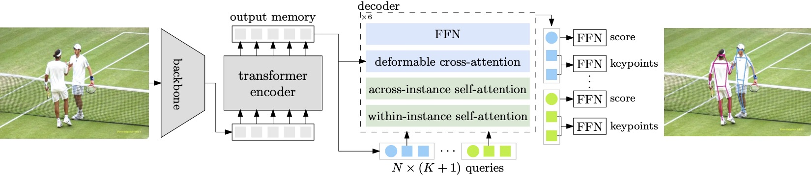

# Group Pose

This repository is an official paddlepaddle implementation of the ICCV 2023 paper "[Group Pose: A Simple Baseline for End-to-End Multi-person Pose Estimation](https://arxiv.org/pdf/2308.07313.pdf)".

☀️ If you find this work useful for your research, please kindly star our repo and cite our paper! ☀️

### TODO
We are working hard on following items.

- [x] Release [arXiv paper](https://arxiv.org/pdf/2308.07313.pdf)
- [x] Release [PyTorch scripts](https://github.com/Michel-liu/GroupPose)

## Introduction

In this paper, we study the end-to-end multi-person pose estimation and present a simple yet effective transformer approach, named Group Pose. **We simply regard $K$-keypoint pose estimation as predicting a set of $N\times K$ keypoint positions, each from a keypoint query, as well as representing each pose with an instance query for scoring $N$ pose predictions.**



Motivated by the intuition that the interaction, among across-instance queries of different types, is not directly helpful, we make a simple modification to decoder self-attention. **We replace single self-attention over all the $N\times(K+1)$ queries with two subsequent group self-attentions: (i) $N$ within-instance self-attention, with each over $K$ keypoint queries and one instance query, and (ii) $(K+1)$ same-type across-instance self-attention, each over $N$ queries of the same type.** The resulting decoder removes the interaction among across-instance type-different queries, easing the optimization and thus improving the performance. Experimental results on MS COCO and CrowdPose show that our approach without human box supervision is superior to previous methods with complex decoders, and even is slightly better than ED-Pose that uses human box supervision.


## Inference
The checkpoints can be found here([baidu](https://pan.baidu.com/s/1BkFTB2bel_a5n55hd-afQQ?pwd=y5k2) & [onedrive](https://1drv.ms/f/s!Aqkrc9gPuk8jqYQ0pw4QG0PKsmq0EA?e=FeuHwB) & [Google Drive](https://drive.google.com/drive/folders/1exJMkr7j_HbItRM-u7DWT7scx1n4htiF?usp=sharing)) with the `.pdparams` suffix.

### Requirements
The code is developed and validated with ```python=3.8.17,paddlepadlle=2.5.1,cuda=11.2```. Higher versions might be as well. Please follows the [Installation](docs/tutorials/INSTALL_cn.md) instruction to prepare the environment.

### Resnet-50 on COCO
Please first download the pretrained model and save it into the `output` folder (or you can change the `weight` param in the config file).
```bash
python tools/eval.py -c configs/keypoint/group_pose/group_pose_r50_4scale_coco.yml
```


## Main Results

### Results on MS COCO val2017 set
| Method                             | Backbone  | Loss Type   | AP          | AP<sub>50</sub>   | AP<sub>75</sub>   | AP<sub>M</sub>    | AP<sub>L</sub>    |
|------------------------------------|-----------|--------|-------------|-------------|-------------|-------------|-------------|
| [PETR](http://openaccess.thecvf.com/content/CVPR2022/html/Shi_End-to-End_Multi-Person_Pose_Estimation_With_Transformers_CVPR_2022_paper.html)             | ResNet-50 | HM+KR  | 68.8    |  87.5     | 76.3    | 62.7     |  77.7     |
| [PETR](http://openaccess.thecvf.com/content/CVPR2022/html/Shi_End-to-End_Multi-Person_Pose_Estimation_With_Transformers_CVPR_2022_paper.html)             | Swin-L    | HM+KR  | 73.1     |  90.7     | 80.9    |  67.2     |  81.7     |
| [QueryPose](https://arxiv.org/abs/2212.07855) | ResNet-50 | BR+RLE | 68.7     |  88.6     |  74.4    | 63.8     | 76.5    |
| [QueryPose](https://arxiv.org/abs/2212.07855) | Swin-L    | BR+RLE | 73.3     |  91.3     |  79.5     |  68.5     |  81.2     |
| [ED-Pose](https://arxiv.org/abs/2302.01593)    | ResNet-50 | BR+KR  | 71.6     |  89.6     |  78.1     |  65.9     |  79.8     |
| [ED-Pose](https://arxiv.org/abs/2302.01593)    | Swin-L    | BR+KR  | 74.3    |  91.5     |  81.6     |  68.6     |  82.6     |
| **GroupPose**                          | ResNet-50 | KR     |  72.0     |  89.4     |  79.1     |  66.8     |  79.7     |
| **GroupPose**                          | Swin-T    | KR     |  73.6     |  90.4     |  80.5     |  68.7     |  81.2     |
| **GroupPose**                          | Swin-L    | KR     | **74.8** | **91.6**  | **82.1**  | **69.4**  | **83.0**  |
> HM, BR and KR denote heatmap, human box regression and keypoint regression.


### Results on MS COCO test2017 set
| Method                             | Backbone  | Loss Type   | AP          | AP<sub>50</sub>   | AP<sub>75</sub>   | AP<sub>M</sub>    | AP<sub>L</sub>    |
|------------------------------------|-----------|--------|-------------|-------------|-------------|-------------|-------------|
| [PETR](http://openaccess.thecvf.com/content/CVPR2022/html/Shi_End-to-End_Multi-Person_Pose_Estimation_With_Transformers_CVPR_2022_paper.html)             | ResNet-50 | HM+KR  |  67.6     |  89.8     |  75.3     |  61.6     |  76.0     |
| [PETR](http://openaccess.thecvf.com/content/CVPR2022/html/Shi_End-to-End_Multi-Person_Pose_Estimation_With_Transformers_CVPR_2022_paper.html)             | Swin-L    | HM+KR  |  70.5     |  91.5     |  78.7     |  65.2     |  78.0     |
| [QueryPose](https://arxiv.org/abs/2212.07855) | Swin-L    | BR+RLE |  72.2     |  92.0     |  78.8     |  67.3     |  79.4     |
| [ED-Pose](https://arxiv.org/abs/2302.01593)    | ResNet-50 | BR+KR  |  69.8     |  90.2     |  77.2     |  64.3     |  77.4     |
| [ED-Pose](https://arxiv.org/abs/2302.01593)    | Swin-L    | BR+KR  |  72.7     |  92.3     |  80.9     |  67.6     |  80.0     |
| **GroupPose**                          | ResNet-50 | KR     |  70.2     |  90.5     |  77.8     |  64.7     |  78.0     |
| **GroupPose**                          | Swin-T    | KR     |  72.1     |  91.4     |  79.9     |  66.7     |  79.5     |
| **GroupPose**                          | Swin-L    | KR     | **72.8**  | **92.5**  | **81.0**  | **67.7**  | **80.3**  |


### Results on CrowdPose test set

| Method                             | Loss   | AP          | AP<sub>50</sub>   | AP<sub>75</sub>   | AP<sub>E</sub>    | AP<sub>M</sub>    | AP<sub>H</sub>    |
|------------------------------------|--------|-------------|-------------|-------------|-------------|-------------|-------------|
| [PETR](http://openaccess.thecvf.com/content/CVPR2022/html/Shi_End-to-End_Multi-Person_Pose_Estimation_With_Transformers_CVPR_2022_paper.html)              | HM+KR  |  71.6     |  90.4     |  78.3     |  77.3     |  72.0     |  65.8  |
| [QueryPose](https://arxiv.org/abs/2212.07855) | BR+RLE |  72.7     | **91.7**  |  78.1     |  79.5     |  73.4     |  65.4     |
| [ED-Pose](https://arxiv.org/abs/2302.01593)    | BR+KR  |  73.1     |  90.5     |  79.8     |  80.5     |  73.8     |  63.8     |
| **GroupPose**                          | KR     | **74.1**  |  91.3     | **80.4**  | **80.8**  | **74.7**  |  **66.4**     |
> All methods are with the Swin-L backbone.

## License
Group Pose is released under the Apache 2.0 license. Please see the [LICENSE](LICENSE) file for more information.

## Acknowledgement
This project is built on the open source repositories [PaddleDetection](https://github.com/PaddlePaddle/PaddleDetection). Thanks them for their well-organized codes!

## Citation

```bibtex
@inproceedings{liu2023GroupPose,
  title       = {Group Pose: A Simple Baseline for End-to-End Multi-person Pose Estimation},
  author      = {Liu, Huan and Chen, Qiang and Tan, Zichang and Liu, Jiangjiang and Wang, Jian and Su, Xiangbo and Li, Xiaolong and Yao, Kun and Han, Junyu and Ding, Errui and Zhao, Yao and Wang, Jingdong},
  booktitle   = {Proceedings of the IEEE International Conference on Computer Vision (ICCV)},
  year        = {2023}
}
```
